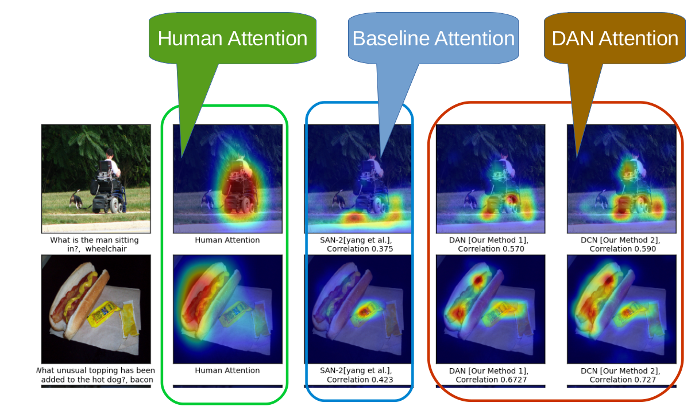
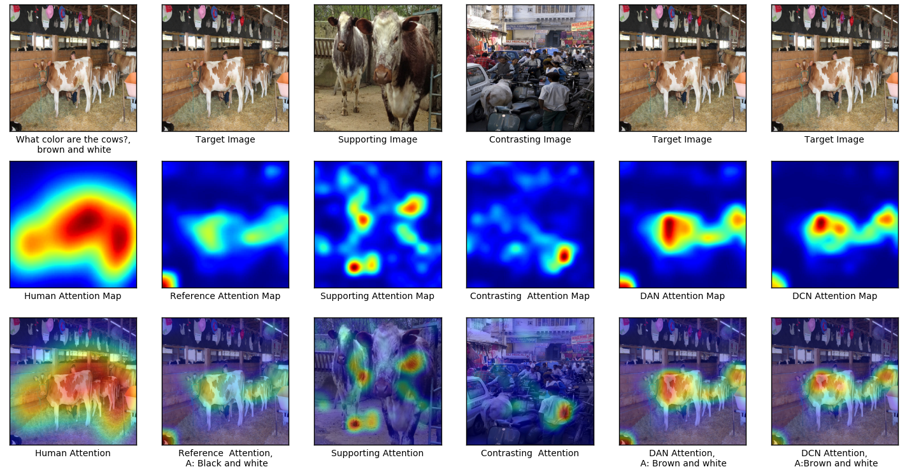
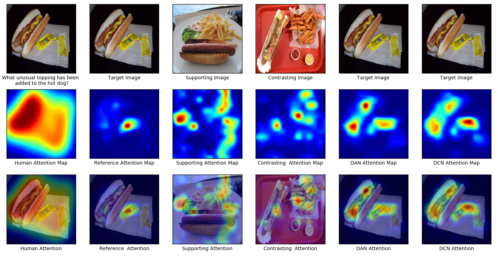
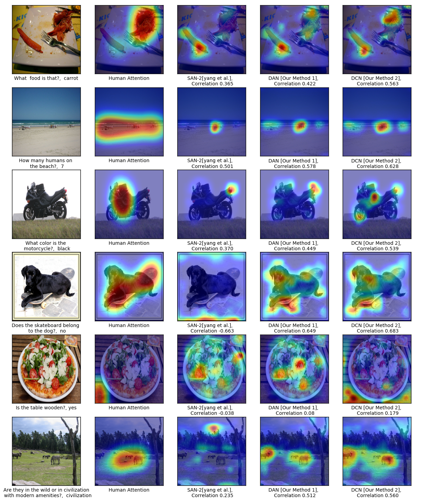
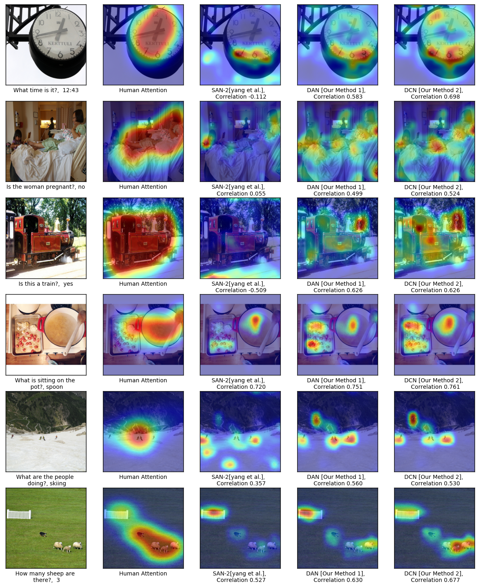

## Differential Attention for Visual Question Answering
Badri Patro,Vinay P. Namboodiri

### Motivation
-   We adopt an exemplar based approach to improve visual question answering (VQA) methods by providing a differential attention.
-   We evaluate two variants for obtaining differential attention - one where we only obtain attention and the other where we obtain differential context in addition to attention.
-    We show that this method correlates better with human attention and results in an improved visual question answering that improves the state-of-the-art for image based attention methods. It is also competitive with respect to other proposed methods for this problem.

### Introduction

<p align="center">
 
</p>

Illustration of improved attention obtained using Differential Context Network. Using the baseline reference we got answer as: ``Black and White`` But, using our methods DAN or DCN we get answer as ``Brown and White``, that is actually the color of the cow. We provide the attention map that indicates the actual improvement in attention.

### **VQA Models**
We provide two different variants for obtaining differential attention in the VQA system. We term the first variant a ``Differential Attention Network`` (DAN) and the other a ``Differential Context Network`` (DCN)

#### DAN Model 
In the DAN method, we use a multi-task setting. As one of the tasks we use a triplet loss to learn a distance metric and the other task is the main task of VQA.

 

#### DCN Model 

We next propose where the differential context feature is added instead of only using it for obtaining attention. The first two parts are same as that for the DAN network. third terms gives the context vector using projection and rejection netwrok.

 

### Results

 

#### Attention Visualization

In this figure, the first column indicates target question and corresponding image, second column indicates reference human attention map in HAT dataset, third column refer to generated attention map for SAN, fourth column refers to rank correlation of our DAN model and final column refers to rank correlation for our DCN model.


#### Attention Visualization with Supporting and opposing Exemplar

In this figure, the first	row indicates the given target image, supporting image and opposing image. second row indicates the attention map for human, reference attention map, supporting attention map , opposing attention map, DAN and DCN attention map respectively. Third row generates result by applying attention map on corresponding images.


***

---


### Attention visualization of DCN with various Human Attention Maps 

DCN Attention Map with  all ground truth three human attentions. The first row provides results for the human attention map-1 for HAT dataset. The second row and third row  provides results for the human attention map-2 and human attention map-3. Similar results for another example.


***


### Attention Visualization of DAN and DCN 

Attention Result for DAN and DCN. In this figure, the first column indicates target question and corresponding image, second column indicates reference human attention map in HAT dataset, third column refer to generated attention map for SAN, fourth column refers to rank correlation of our DAN model and final column refers to rank correlation for our DCN model.


___


####  How important are the supporting and contrasting exemplar?


Importance of Supporting exemplar vs both. the first column in the figure indicates about image and corresponding question, the second  and third term indicates attention map for supporting exemplar and both supporting and opposing exemplar. The fourth and fifth column gives the value of rank correlation for supporting and both.


#### Contribution of different term in DCN


 Ablation Results for Dropping  terms in equation 3 and 4. The first column indicate the target image and its question, The second column provides the attention map \& rank correlation by dropping $2^{nd}$ in equation 3 \& $i^{st}$  term in equation 4. The third column gives the attention map \& rank correlation by dropping only  $i^{st}$  term in equation 4. Final column provides the attention map \& rank correlation by consider every thing in both the equation.

```

